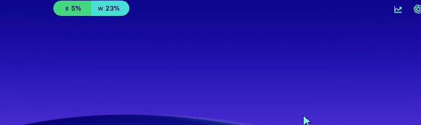

# Claude Meter

A native macOS menu-bar app that shows your **Claude usage** as a Dynamic Island–style pill — your **session** (5‑hour) and **weekly** limits, with live reset countdowns, always a glance away.

> Built for people who live in **Claude Code** / **claude.ai** and want to stop hitting rate-limit walls by surprise.



## What it does

A small pill sits in your menu bar (parked beside the notch). It shows how much of your Claude **session** and **weekly** limits you've used — color-coded green → red — and counts down to each reset. Hover it for a detail card. It refreshes itself in the background and the moment you look at it.

## Features

- **Combined pill** — session (S) and weekly (W) percentages side by side, tinted by how close you are to the limit.
- **Hover card** — currently used, weekly used, current/weekly reset countdowns, last refresh.
- **Green → red spectrum** with automatic black/white text for contrast; every band is customizable.
- **Notch-aware placement** — pick built-in display, the active screen, the screen under your mouse, or a specific monitor.
- **Smart refresh** — configurable background interval (60s–30min) plus hover-to-refresh.
- **Appearance** — System / Dark / Light (the pill stays dark by design); launch at login; optional menu-bar icon.
- **100% local** — no servers, no telemetry, no account with anyone but Claude.

## How it works

Claude has no public usage API. Claude Meter reads the **same authenticated endpoint the claude.ai website uses** — `GET /api/organizations/{org}/usage` — from inside a hidden WebKit view that carries your normal claude.ai login (a `sessionKey` cookie stored only in the app's local container). It decodes the session/weekly utilization and reset timestamps and renders them.

Nothing leaves your Mac except the request to `claude.ai` itself.

> WARNING: Because it relies on an **undocumented endpoint** plus your web session, it can break if Anthropic changes things. This is a personal-use convenience tool, not an official Anthropic product, and isn't affiliated with or endorsed by Anthropic.
> The app checks GitHub on launch and prompts you when a fix ships.

## Privacy & security

- No accounts, no servers, no analytics, no data collection.
- Your Claude session cookie stays in the app's local WebKit store on your Mac.
- The app talks only to `claude.ai`.
- Fully open source — read every line before you trust it.

## Requirements

- macOS 14 (Sonoma) or later.
- A Claude account (Pro / Max / Team) you can sign into at claude.ai.

## Install

### Option A — download the app (recommended)

1. Get the latest build from **[claude.sanchitkd.com](https://claude.sanchitkd.com/)** — or [download directly](https://github.com/sanchitkd/claude-meter/releases/latest/download/ClaudeMeter.app.zip) / browse [all releases](https://github.com/sanchitkd/claude-meter/releases).
2. Unzip and move **`ClaudeMeter.app`** to `/Applications`.
3. **First launch:** the app is unsigned, so macOS Gatekeeper will warn you. **Right-click the app -> Open -> Open**, or go to **System Settings -> Privacy & Security -> "Open Anyway."** You only do this once.

### Option B — build from source

```bash
git clone https://github.com/sanchitkd/claude-meter.git
cd claude-meter
./scripts/build-app.sh
open .build/release/ClaudeMeter.app
```
Needs the Swift 6 toolchain (Xcode 16+) and macOS 14+.

## First run & sign-in

On first launch a **"Sign in to Claude"** window opens.

- **Use Email sign-in** (enter your email -> one-time code).
- **Google sign-in won't work here** — Google blocks OAuth inside embedded app windows (their anti-phishing policy). Use email.

Once you're in, the window closes automatically and the pill fills with your usage. The session persists across launches. If it ever expires, right-click the pill -> **Sign in to Claude**.

## Using it

- **Pill** (menu bar): `S 42%  W 13%` — color shows how close to the limit you are.
- **Hover** -> detail card (and an instant refresh if the data is stale).
- **Right-click** the pill or menu-bar icon -> Sign in - Refresh - Open Claude - Open Usage Page - Open Logs - Preferences - Quit.
- **Gear** (top-right of the card) -> Preferences.

## Settings

| Section | Options |
|---|---|
| **Updates** | Refresh interval (60s-30min), enable animations |
| **App** | Launch at login, show menu-bar icon, appearance (System/Dark/Light) |
| **Pill Position** | Built-in display - Active screen - Screen under mouse - Specific display |
| **Usage Colors** | Customize each band of the green -> red palette |
| **Logs** | Current size, Rotate (keeps one backup), Clear |

## Architecture

Swift Package with two targets:

- **`ClaudeMeter`** — the app entry point (`@main`, accessory activation policy).
- **`ClaudeMeterCore`** — everything else:
  - **Providers** — `ClaudeWebSession` (WebKit + the usage endpoint), `AnthropicUsageProvider`, `AnthropicUsageModels`, `ClaudeLoginWindowController`.
  - **Domain** — `UsageSnapshot` / `UsageWindow` / `UsageStatus`, provider protocol, `UsageColorPalette`.
  - **State** — `UsageStateManager` (refresh loop + countdown clock), `SettingsManager`.
  - **UI** — `IslandView` (pill + hover card), `UsageColorResolver`, `SettingsView`.
  - **Platform** — `IslandPanelController` (the floating panel + screen placement), `AppearanceController`, `SettingsWindowController`.
  - **Utilities** — `AppLogger`, `UsageFormatters`.

## Development

Compile:

```bash
swift build -c release
```

Run via the app bundle — recommended, because running with `swift run` has WebKit/CoreAnimation lifecycle issues for this style of app:

```bash
./scripts/build-app.sh
open .build/release/ClaudeMeter.app
```

For a fast rebuild-and-relaunch loop, add an alias to `~/.zshrc` (adjust the path to your clone):

```bash
alias cm='cd ~/path/to/claude-meter && ./scripts/build-app.sh && killall ClaudeMeter 2>/dev/null; open .build/release/ClaudeMeter.app'
```

Then just run `cm` to rebuild and relaunch.

## Troubleshooting

- **"Sign in to Claude to show usage"** -> right-click the pill -> **Sign in** (use email).
- **Can't see the pill** -> it may be on another display; Preferences -> **Pill Position**.
- **Logs** -> `~/Library/Application Support/ClaudeMeter/ClaudeMeter.log` (or Preferences -> Logs -> Show in Finder).

## Roadmap

- Optional update notifications (version check / Sparkle).
- Live plan name.
- Signed + notarized builds (no Gatekeeper prompt).

## Author

Built by **Sanchit Dikshit** — [sanchitkd.com](https://www.sanchitkd.com) - [Dev.to](https://dev.to/sanchitkd) - GitHub [@sanchitkd](https://github.com/sanchitkd).

Feedback or hi: **[sanchitkd.com/#contact](https://www.sanchitkd.com/#contact)**.

If you use or fork Claude Meter, a star on the repo and a link back are appreciated.

## License

[MIT](LICENSE) © 2026 Sanchit Dikshit. Not affiliated with Anthropic. "Claude" is a trademark of Anthropic.
